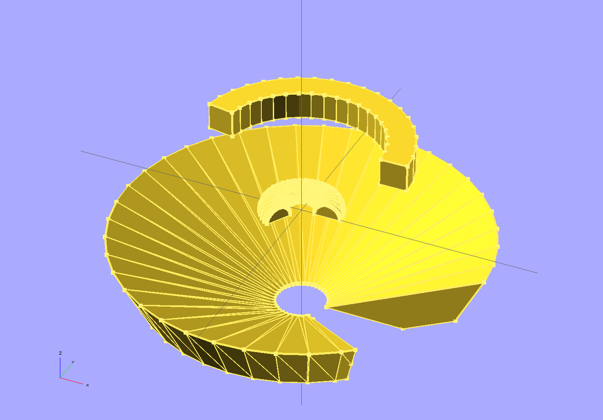

# mscad

ms's libraries for OpenSCAD.

## Contents

* [extrusions.scad](extrusions.scad): 2D-to-3D extrusions.

## Installation

Clone this repository into the OpenSCAD
[built-in library directory](http://en.wikibooks.org/wiki/OpenSCAD_User_Manual/Libraries). In
OpenSCAD 2014.03 and newer, you can open this directory using `File > Show
Library Folder`. It's usually one of the following:

* Windows: `My Documents\OpenSCAD\libraries`
* Linux: `$HOME/.local/share/OpenSCAD/libraries`
* Mac OS X: `$HOME/Documents/OpenSCAD/libraries`

(You can also put a symlink there, if you prefer.)

## Usage

    use <mscad/extrusions.scad>
    test_extrusions();

